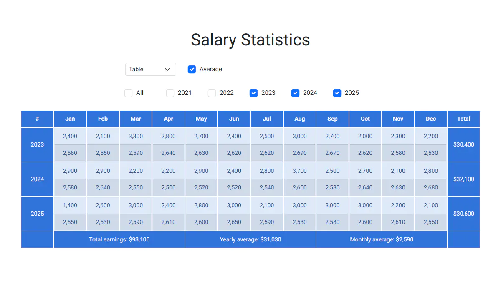
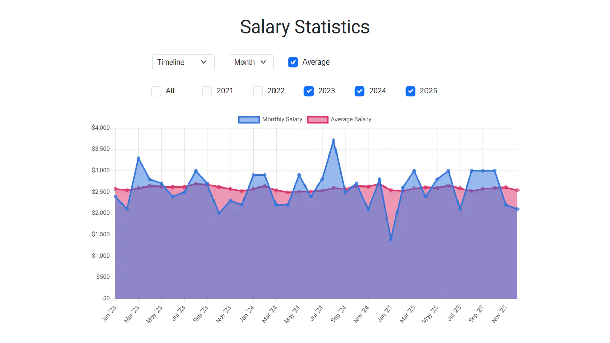
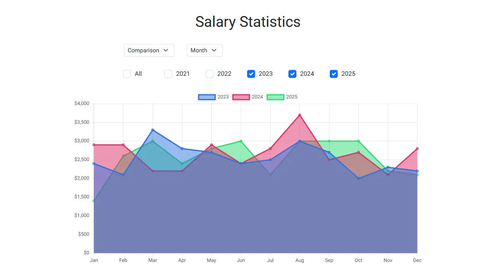

# Salary Statistics

A headless WordPress + React application for visualizing salary data across months and years.
It presents trends through tables and charts with dynamic filtering. The backend is powered
by a custom WordPress REST API that provides either real or generated demo data.

**Live Demo:** https://demo.arsen.pro/react/salary-statistics/


## Screenshots

### Table

<kbd>
  
</kbd>

### Timeline

<kbd>
  
</kbd>

### Comparison

<kbd>
  
</kbd>


## Features

* Multiple data views: table, timeline chart, and comparison chart
* Dynamic filtering and data selection
* Year-to-year and month-to-month salary comparison
* Rolling 12-month average salary calculation
* Summary statistics for selected years: total earnings, yearly and monthly averages
* Private mode with access to real salary records via a URL token
* Public demo mode with generated salary data
* Responsive layout for desktop and mobile


## Technologies

* React
* Redux Toolkit
* TypeScript
* Chart.js
* WordPress REST API
* PHP
* HTML5
* CSS3
* Jest
* React Testing Library


## Quality

The project has 100% unit test coverage using Jest and React Testing Library.


## Backend Setup

The backend is implemented as a custom WordPress plugin exposing a REST API endpoint.

The backend operates in two modes:

* **Private mode** returns real salary data stored in the WordPress custom post type.
  It is enabled by supplying a secret token as a URL query parameter.
* **Public mode** returns generated demo salary data for portfolio purposes.

Salary data is stored as a WordPress custom post type (`salaries`) with twelve ACF `number` fields:
`m0`, `m1`, `m2`, ..., `m11`. The endpoint returns a JSON object where each key is a year
and each value is an array of twelve monthly salary values.

**Note:** For the current month and all future months of the current year, the API returns `0`.


### Response Example

```json
{
  "2026": [3300, 3100, 2600, 2700, 2200, 0, 0, 0, 0, 0, 0, 0],
  "2025": [2400, 2200, 2400, 2200, 3000, 2900, 2100, 2500, 2600, 2200, 3200, 2900],
  "2024": [2500, 2100, 2300, 2100, 2400, 2000, 2600, 2700, 3200, 2800, 2200, 2300]
}
```